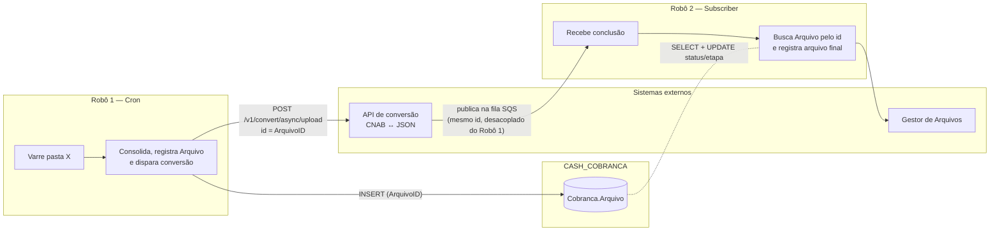
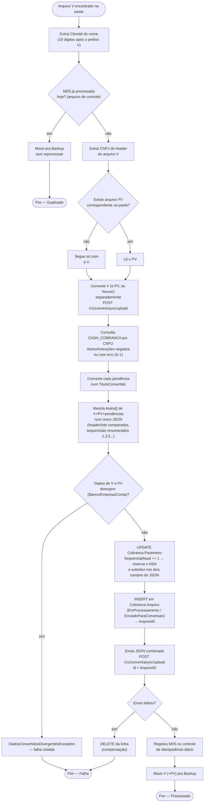
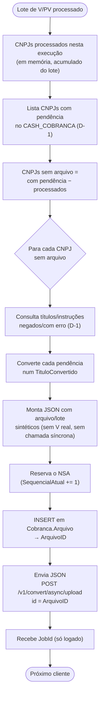
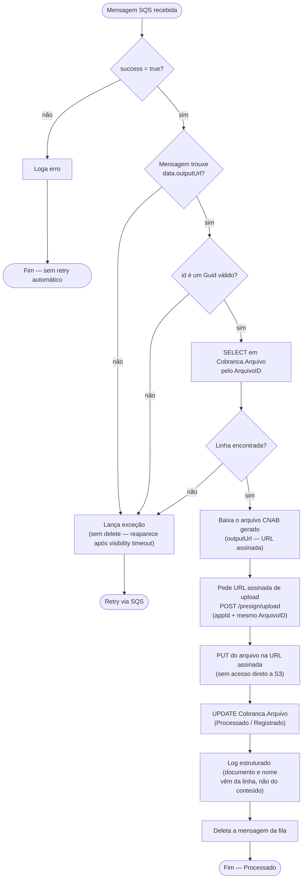
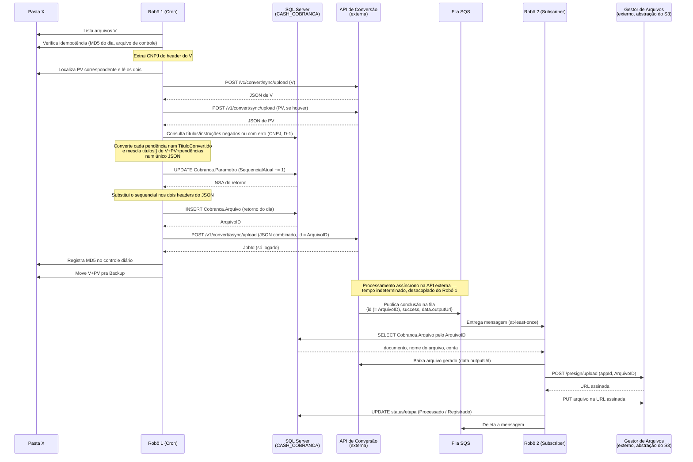
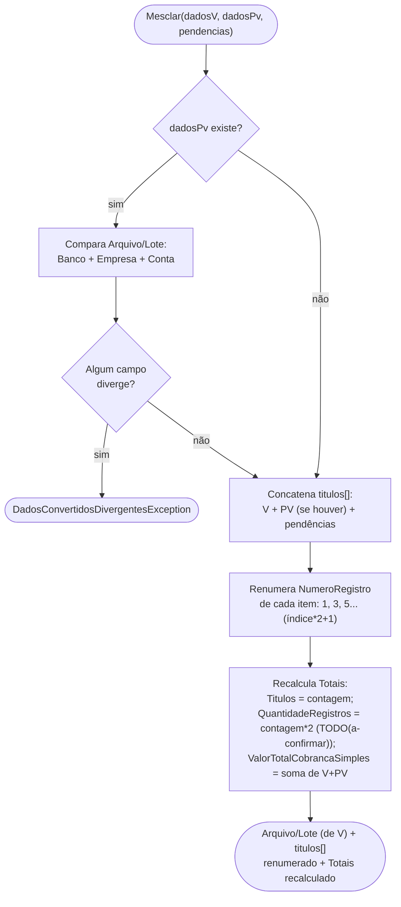
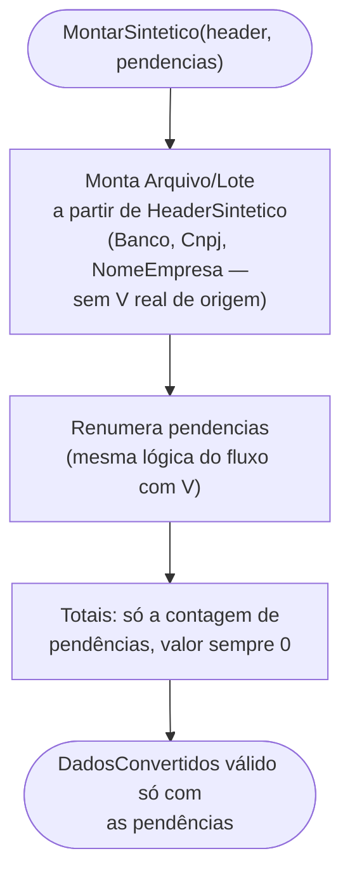

# Regras de negócio

Documentação funcional do fluxo implementado nos dois robôs — o "o quê" e
"por quê", complementando o código (o "como"). Todo diagrama aqui reflete
o que está implementado hoje em `src/`; onde a regra ainda não foi
confirmada, o diagrama marca explicitamente **[STUB]** e o texto ao lado
aponta pro `TODO(a-confirmar)` correspondente no código.

## Visão geral

Dois processos independentes, sem comunicação direta entre si:

- **Robô 1** (`CnabRetorno.RetornoCron.Worker`) roda por cron (arquivos
  chegam por volta das 6h), varre uma pasta por arquivos de retorno,
  extrai o CNPJ do cliente do header do V, converte V e PV
  **separadamente** pro conversor síncrono, consulta pendências (títulos e
  instruções negados ou com erro) na base **CASH_COBRANCA** e converte
  cada uma num objeto no mesmo shape de título, e **mescla tudo — títulos
  de V, de PV e das pendências — num único JSON**. Antes de enviar,
  **registra o arquivo de retorno em `Cobranca.Arquivo`** e usa o
  `ArquivoID` gerado como identificador da conversão assíncrona.
- **Robô 2** (`CnabRetorno.RetornoSubscriber.Worker`) reage, via fila SQS,
  à conclusão dessa geração assíncrona — publicada por essa API externa,
  não pelo Robô 1. A mensagem devolve o mesmo `id`, então o robô **busca a
  linha em `Cobranca.Arquivo`** pra saber de quem é o arquivo, armazena o
  CNAB final no Gestor de Arquivos (presign com esse mesmo id) e marca a
  linha como registrada.

### Decisões

- **V, PV e pendências do CASH_COBRANCA são unidos a nível de JSON, não de
  CNAB bruto.** V e PV são dois arquivos CNAB240 retorno FEBRABAN
  completos, cada um com lançamentos que o outro não tem, convertidos
  **separadamente** pelo conversor síncrono; além deles, títulos/instruções
  negados ou com erro na base CASH_COBRANCA viram objetos `TituloConvertido`
  montados na hora. A fusão dos três `titulos[]` acontece a nível de JSON
  (headers comparados, sequenciais renumerados, totais recalculados), só
  então enviada ao conversor assíncrono. Essa é literalmente a abordagem
  "múltiplas conversões + reconciliar JSONs" que uma rodada anterior deste
  projeto havia descartado por "não ter como reconciliar JSONs de forma
  confiável sem conhecer o contrato inverso da API" — motivo que deixou de
  valer assim que o contrato real (com exemplos concretos de request/
  response) foi confirmado. Ver `Json.MesclagemDadosConvertidos`.
- **Fonte das pendências é o schema real do CASH_COBRANCA** (`Titulo.Titulo`,
  `Titulo.TituloErro`, `Instrucao.Instrucao`, `Instrucao.InstrucaoErro` —
  ver docs/cash-cobranca-referencia.md), não mais um schema placeholder.
  Substituiu por completo a tabela fictícia `ParametroRetorno` que existia
  antes — o CNPJ do header do V é quem consulta o banco agora, não mais um
  "ClientId → Documento" indireto.
- **Nenhum robô tem banco próprio — mas os dois escrevem em
  `Cobranca.Arquivo`.** Não há tabela nossa, nem Postgres, nem histórico
  de auditoria paralelo: a única escrita é no registro que o ecossistema
  CASH inteiro já usa pra rastrear arquivo (Robô 1 cria a linha do retorno
  antes de enviar; Robô 2 avança status/etapa ao concluir). Idempotência
  de reprocessamento continua fora do banco — arquivo de controle na pasta
  de origem, resetado diariamente (`ControleIdempotenciaDiario`).
- **`Cobranca.Arquivo.ArquivoID` é a única ponte de dado entre os robôs.**
  O Robô 1 registra e manda esse Guid como `id` da conversão assíncrona; a
  mensagem de conclusão devolve o mesmo `id`; o Robô 2 lê a linha pra
  saber de quem é o arquivo e presigna o storage com esse mesmo
  identificador. Isso substitui as heurísticas anteriores (extrair
  ClientId do nome do arquivo, extrair CNPJ do header do CNAB baixado) —
  **os robôs continuam sem se falar diretamente**, a correlação passa pelo
  registro compartilhado + pela API externa.

## Robô 1 — processamento de um arquivo V (+ PV)

Roda uma vez por arquivo V encontrado na pasta, em paralelo (ver
`Pipeline:MaxArquivosConcorrentes`). Implementado em
`ProcessadorArquivoRetornoService.ProcessarAsync`.

### Regras por passo

| # | Regra | Onde está no código |
|---|---|---|
| 1 | ClientId = 10 dígitos logo após o prefixo `V`/`PV` no nome do arquivo (sem extensão) — usado só pra localizar o PV na pasta, não mais pra consultar o banco | `Core.Dominio.NomeArquivoRetorno.TentarExtrairClientId` |
| 2 | Idempotência por MD5 do conteúdo do V, resetada diariamente — arquivo repetido no mesmo dia não gera nova conversão. Sem tabela: controle é um arquivo `.processados-hoje.json` na pasta de origem | `Origem.ControleIdempotenciaDiario` |
| 3 | **CNPJ é extraído do header de arquivo (tipo 0, posições 19-32) logo na leitura do V** — é essa string que consulta o CASH_COBRANCA, não mais o ClientId do nome do arquivo | `Cnab240Campos.ExtrairCnpjHeaderArquivo` |
| 4 | PV é localizado por correspondência de ClientId, não por convenção de pasta — **sem regra definida pra "V sem PV"**: hoje segue o fluxo só com o V, sem marcar erro | `PastaOrigemArquivosRetorno.LocalizarPvCorrespondente` |
| 5 | **V e PV são convertidos separadamente**, cada um numa chamada `POST /v1/convert/sync/upload` (multipart: `file`+`appId`+`pipeline`+`id`) — não existe mais uma etapa de mesclagem de CNAB bruto antes da conversão | `ILayoutConversaoApiClient.ConverterCnabParaJsonAsync` |
| 6 | **Consulta ao CASH_COBRANCA por CNPJ**: títulos com `CodigoStatus` negado OU com linha em `Titulo.TituloErro`, e instruções com `CodigoStatus` negado OU com linha em `Instrucao.InstrucaoErro`, na janela **D-1**. Título/instrução negado E com erro ao mesmo tempo gera **um único item** (dedupe por ID) | `Persistencia.CobrancaPendenciasRepository.ObterTitulosNegadosOuComErroAsync` / `ObterInstrucoesNegadosOuComErroAsync` |
| 7 | Cada título/instrução pendente vira um objeto `TituloConvertido` (mesmo shape que um título normal do JSON) — `Ocorrencia.Codigo`/`Descricao` vêm direto de `Titulo.CodigoOcorrencia`/`DescricaoOcorrencia` (fallback `03`/`26` — Entrada/Instrução Rejeitada — se vazio); `Motivos` é literal fixo `"0000000000"` | `Json.PendenciasParaTitulosConvertidosFactory.ConverterTitulo` / `ConverterInstrucao` |
| 8 | **Mesclagem a nível de JSON**: compara Banco+Empresa(tipo+inscrição)+Conta dos `Arquivo`/`Lote` de V e PV — diverge, aborta (falha isolada). Concatena `titulos[]` de V, PV e pendências (nessa ordem), renumera `NumeroRegistro` sequencial (`1, 3, 5...`) e recalcula `Totais` (`ValorTotalCobrancaSimples` = soma de V+PV; pendência não contribui valor) | `Json.MesclagemDadosConvertidos.Mesclar` |
| 9 | **Sequencial do arquivo (NSA) vem do controle próprio, não do V** — incrementa `Cobranca.Parametro.SequencialAtual` do cliente e substitui o valor nos **dois** campos do JSON (`arquivo.numeroSequencialArquivo` e `lote.numeroRemessaRetorno`). A série é compartilhada entre remessa e retorno; o número que vem no header do V é o da remessa e vem errado se o arquivo for regerado. Reservado **depois** da mesclagem dar certo, pra não abrir buraco na série | `Persistencia.SequencialArquivoRepository.ReservarProximoAsync` + `Json.MesclagemDadosConvertidos.AplicarSequencial` |
| 10 | **Registro em `Cobranca.Arquivo` antes do envio assíncrono** — uma linha por arquivo de retorno (um por dia, por cliente), com `AppID = "cash-cobranca"`, documento/tipo/conta do cliente tirados do próprio JSON, status/etapa iniciais `EmProcessamento`/`EnviadoParaConversao`. Só acontece depois das conversões síncronas darem certo, pra não deixar registro de arquivo que nunca foi enviado | `Persistencia.ArquivoRepository.RegistrarEnvioParaConversaoAsync` |
| 11 | Conversão final é **assíncrona** (`POST /v1/convert/async/upload`, JSON combinado como "arquivo"), com **`id` = `ArquivoID`** — é essa correlação que volta na mensagem SQS e permite ao Robô 2 achar o cliente. Se o envio falhar, a linha é removida (compensação). O robô registra o JobId só em log, não espera o resultado | `ILayoutConversaoApiClient.ConverterJsonParaCnabAsync` |
| 12 | Registro no controle de idempotência acontece **antes** de mover o arquivo — se a movimentação falhar, a reexecução detecta o MD5 já processado hoje e só limpa a pasta | `ProcessadorArquivoRetornoService.ProcessarAsync` |
| 13 | V e PV (se existir) são movidos juntos pra Backup | `PastaOrigemArquivosRetorno.MoverParaBackupAsync` |

Removido do escopo, por decisão explícita: gate de "dado suficiente pra
gerar retorno" (sempre segue pra conversão), persistência de
status/auditoria em banco, publicação de mensagem de tracking pro Robô 2.

## Robô 1 — laço de clientes sem arquivo

Depois de processar todos os V/PV do lote, compara quem foi processado com
a lista de CNPJs que têm pendência no CASH_COBRANCA. Implementado em
`ProcessadorClientesSemArquivoService.ExecutarAsync`. Sem persistência: a
lista de "CNPJs processados" vem do resumo **em memória** da execução
atual (`ResumoExecucao.CnpjsProcessados`, acumulado enquanto
`ProcessarArquivosVePvPipeline` processa o lote), não de uma tabela.

Sem um V real de origem, não há CNAB pra converter de forma síncrona — o
JSON (arquivo/lote **sintéticos mínimos**: Banco de config, CNPJ do
cliente, sem agência/conta — `TODO(a-confirmar)`, não há um banco "dono"
óbvio pra um arquivo que não veio de nenhum V real) é montado direto e
mandado pro conversor assíncrono.

Por que isso existe: um cliente pode não ter recebido nenhum V/PV no lote
do dia, mas ainda assim ter títulos/instruções negados ou com erro do dia
anterior que precisam virar um arquivo de retorno — daí o robô precisar
olhar a lista completa de CNPJs com pendência, não só os arquivos que
chegaram.

## Robô 2 — conclusão da conversão assíncrona

Um handler por mensagem recebida — implementado em
`ProcessarConclusaoConversaoService.ProcessAsync`, chamado pelo
`SqsConsumerHostedService` genérico de `CnabRetorno.Common`.

**Nota sobre as heurísticas removidas**: até esta rodada o Robô 2
adivinhava de quem era o arquivo — extraía `ClientId` do nome e CNPJ do
header do CNAB baixado. Nada disso é necessário agora: o `id` da mensagem
é o `ArquivoID` que o Robô 1 registrou, e a linha tem documento, tipo de
documento, conta e nome do arquivo. `NomeArquivoRetorno` e
`Cnab240Campos` deixaram de ser usados por este worker.

**Nota sobre a validação de integridade**: o shape real da mensagem de
conclusão (ver `docs/cash-cobranca-referencia.md` §2.4) não tem nenhum
campo de hash — diferente do que se assumia numa versão anterior
(`Md5ArquivoGerado`). Não há checagem de integridade no Robô 2 hoje.

**Nota sobre o passo I**: antes desta mudança, o Robô 2 resolvia o
"documento" do cliente consultando uma tabela `ParametroRetorno`
placeholder, depois um alias de `clientId` sem CNPJ real. Agora o Robô 2
extrai o CNPJ diretamente do header do arquivo CNAB que ele mesmo baixou
no passo D — reaproveitando `Cnab240Campos.ExtrairCnpjHeaderArquivo`
(movido pra `CnabRetorno.Core` por isso, ver [Decisões](#decisões)).
Assume que o layout solicitado pelo cliente preserva as posições padrão
FEBRABAN do header de arquivo; se algum layout mudar isso, o passo I
precisa ser revisado. Mantém os dois robôs desacoplados: nenhum consulta
banco do outro pra resolver esse dado.

**Nota sobre os passos K+L**: contrato real do Gestor de Arquivos
(`docs/cash-cobranca-referencia.md` §3) não tem endpoint de "registrar
arquivo" — upload e registro são a mesma operação (presigned URL + PUT).
Substituiu por completo o antigo par "Armazena no S3" + "Registra via
Gestor de Arquivos" (dois passos STUB/direto-ao-SDK-S3).

### Por que qualquer exceção vira "não deletar"

O `SqsConsumerHostedService` (genérico, em `CnabRetorno.Common`) só deleta
a mensagem da fila depois que `ProcessAsync` retorna sem lançar. Qualquer
exceção — nome de arquivo fora do padrão, falha de rede — faz a mensagem
**não ser deletada**, e ela reaparece sozinha na fila depois do
`VisibilityTimeout`. Isso é **de propósito** (evita perder mensagem), mas
é também o motivo pelo qual uma
falha permanente gera um loop infinito de redelivery — política de
retry/dead-letter queue ainda `TODO(a-confirmar)`.

## Interação entre os dois robôs e os sistemas externos

Note o ponto central da arquitetura: **o Robô 1 nunca fala com o Robô 2, e
vice-versa** — não há chamada direta nem mensagem entre eles. O disparo
continua vindo só da API externa de conversão, que recebe o pedido
assíncrono do Robô 1 e, em algum momento depois, publica a conclusão —
presumivelmente ela mesma, não o Robô 1 — numa fila SQS que o Robô 2
escuta.

O que os dois compartilham agora é um **registro**, não um canal: a linha
em `Cobranca.Arquivo`. Isso é diferente de acoplá-los — a tabela já é a
fonte de verdade do ecossistema CASH pra rastreamento de arquivo (o fluxo
de entrada faz igual), e nenhum dos robôs depende do *estado de execução*
do outro: se o Robô 2 nunca rodar, o Robô 1 não trava nem muda de
comportamento. Ver [Decisões](#decisões) acima pro porquê dessa escolha
(modelo pra dois repositórios futuros).

## Mesclagem de DadosConvertidos (V + PV + pendências) em detalhe

Núcleo do Robô 1 — `Json.MesclagemDadosConvertidos`. Opera sobre os DTOs
já tipados (`DadosConvertidos`/`TituloConvertido`), sem depender de nenhum
parsing de CNAB bruto; assume **um lote por arquivo** (consistente com
`DadosConvertidos.Lote`, que é singular, não uma lista). Dois métodos,
dois cenários:

Por que `ValorTotalCobrancaSimples` soma só V+PV direto (em vez de somar
título a título): os totais de V e PV já vêm calculados corretamente pela
própria API de conversão — reduz superfície de erro reimplementar essa
soma. Pendências do CASH_COBRANCA não contribuem valor, só contam pra
`Titulos`/`QuantidadeRegistros` (nenhuma ocorrência financeira real por
trás de um item rejeitado, mesma decisão de antes).

Os dois métodos compartilham a mesma lógica interna de renumeração e
recálculo de totais — só a origem do `Arquivo`/`Lote` base muda (V real
vs. sintético).

## Idempotência e tratamento de falha

| Cenário | Comportamento | Por quê |
|---|---|---|
| Mesmo arquivo V reenviado no mesmo dia (mesmo MD5) | Move pra Backup sem reprocessar, sem nova chamada à API de conversão | `ControleIdempotenciaDiario` — checagem acontece **antes** de qualquer chamada externa, evitando custo de conversão duplicado. Resetado diariamente (arquivo de controle na pasta de origem) |
| Mesmo arquivo V reenviado em outro dia | **Reprocessado** — o controle de idempotência não persiste entre dias, por decisão explícita (ver [Decisões](#decisões)) | Consequência aceita de não ter controle próprio em banco: sem histórico entre execuções, só dentro do mesmo dia. Gera uma **segunda linha** em `Cobranca.Arquivo` (a tabela não tem constraint de "um retorno por cliente por dia") |
| Falha ao mover o arquivo pra Backup depois de já ter registrado o MD5 | Próxima execução detecta o MD5 já processado hoje e só limpa a pasta — sem reconverter | Registro no controle diário acontece **antes** da movimentação |
| Envio assíncrono falha depois do INSERT em `Cobranca.Arquivo` | A linha é **removida** (compensação) antes da exceção propagar. O sequencial reservado **não** é devolvido | Evita registro de arquivo "enviado pra conversão" que nunca foi. O sequencial não volta de propósito: devolver exigiria ler-decrementar (com corrida), e um buraco na série é menos grave que dois arquivos com o mesmo número |
| Cliente sem linha em `Cobranca.Parametro` (ou mais de uma) | `SequencialIndisponivelException` — falha isolada, **não envia** | Sem o controle não há como saber o sequencial correto; mandar um número errado é pior que não mandar. O V fica na pasta pra reprocessar depois de cadastrar o parâmetro |
| Processo morre entre o INSERT e o envio assíncrono | Linha órfã em `EmProcessamento`/`EnviadoParaConversao`, sem mensagem correspondente | Janela estreita e sem correção automática — a compensação só cobre falha do envio, não morte do processo. Um redelivery não existe (a mensagem nunca foi criada); a linha fica pra investigação manual |
| Dados de V e PV divergem (Banco/Empresa/Conta) | `DadosConvertidosDivergentesException` — falha isolada, arquivo **não é movido**, fica na pasta pra investigação manual | Evita mesclar arquivos que não pertencem à mesma remessa |
| `Success: false` no envelope de `/v1/convert/sync/upload` | `ConversaoCnabFalhouException` — mesmo tratamento de falha isolada | Evita `NullReferenceException` com stack trace enganoso ao acessar `Data` |
| Falha em um arquivo do lote | Não derruba os demais — cada arquivo roda isolado (`try/catch` em `ProcessarArquivosVePvPipeline`), falha vira contador `Falhas` no resumo | Mesma filosofia "falha isolada" do design original deste worker |
| Mensagem do Robô 2 processada com erro | Mensagem não é deletada — reaparece na fila SQS sozinha depois do `VisibilityTimeout` | Ver seção "Por que qualquer exceção vira 'não deletar'" acima — atenção ao risco de loop infinito em falha permanente |
| Robô 2 recebe a mesma mensagem duas vezes (redelivery do SQS) | Reprocessa: baixa de novo e **sobrescreve** o mesmo objeto no Gestor de Arquivos, depois regrava o mesmo status/etapa | Resolvido de graça pelo desenho novo: o `id` do presign é o `ArquivoID` (determinístico), não um GUID novo por tentativa — antes cada redelivery duplicava o objeto armazenado |
| Mensagem SQS com `id` que não existe em `Cobranca.Arquivo` | Exceção → mensagem não é deletada, volta pela fila | Sem a linha não há como saber de quem é o arquivo. Se a causa for permanente (id inválido de vez), vira loop de redelivery — mesma pendência de DLQ do item acima |

## Pontos em aberto (consolidado)

Ver `README.md` raiz, seção "Pontos em aberto", para a lista com
`grep`. Resumo dos que têm impacto direto em regra de negócio (não só
infraestrutura):

> Esta lista é sobre regras ainda **não confirmadas**. Pra riscos de
> comportamento **incorreto** já identificados no código existente
> (duplicidade de pendência, perda silenciosa de dado, trailer
> inconsistente) — mais grave num contexto de processamento bancário —
> ver [`riscos-conhecidos.md`](riscos-conhecidos.md).

1. **`CodigoStatus` "negado"** — `docs/cash-cobranca-referencia.md` não
   documenta os valores possíveis de `Cobranca.Status`; a constante
   `CodigoStatusNegado` em `CobrancaPendenciasRepository` está com um
   valor placeholder, marcado `TODO(a-confirmar)`.
2. **Vários campos do `TituloConvertido` gerado por pendência** não têm
   fonte definida: `Agencia`, `NumeroDocumento`, `NumeroContrato` — ver
   `PendenciasParaTitulosConvertidosFactory`, cada um marcado
   individualmente. Resolvidos nesta rodada: `BancoCobrador`/`AgenciaCobradora`
   (agora `Titulo.TituloRegistroRetorno`) e `Ocorrencia`/`Motivos` (agora
   campos diretos de `Titulo`/`Instrucao`, `Motivos` é literal fixo).
3. **Possível inversão semântica Sacado/Sacador**: o de-para mapeia o
   "pagador" (`sacado` do JSON) a partir de `SacadorAvalista*`, mas no
   CNAB o pagador costuma ser o Sacado — o material de 21/07/2026 confirma
   esse mapeamento literalmente, sem resolver a dúvida semântica (ver
   `Core.Dominio.Titulo`, `docs/cash-cobranca-referencia.md` §2.3), precisa
   confirmação antes de fechar em produção.
4. **Pipeline reverso do conversor** (JSON → CNAB no layout do cliente) —
   só o de CNAB → JSON (`conversao-cobranca-retorno-para-json`) foi
   confirmado por exemplo real; o reverso continua com um nome placeholder
   (`TODO-confirmar-pipeline-json-para-cnab`) até ser confirmado.
5. **Arquivo/lote sintético do laço pós-lote** — sem um V real de origem,
   o `Banco` usado vem de uma opção de config (`PipelineOptions.BancoPadrao`)
   sem um valor "dono" óbvio; agência/conta ficam sempre em branco.
6. **Comportamento V sem PV / PV sem V** — hoje V sem PV segue o fluxo
   normalmente (sem erro); PV sem V correspondente nunca é lido (só é
   localizado a partir de um V já identificado — um PV "órfão" na pasta
   simplesmente não é processado nem movido, permanece na pasta X
   indefinidamente até ter um V correspondente).
7. **Fórmula de `Totais.QuantidadeRegistros`** ao combinar V+PV+pendências
   — nenhum exemplo confirma; assumido `2 por item` (T+U implícito, mesma
   convenção do `NumeroRegistro`). Ver `Json.MesclagemDadosConvertidos`.
   Arquivo V/PV com mais de um lote continua não suportado (assume-se
   sempre um único lote por arquivo).
8. **Idempotência só dentro do mesmo dia** — o mesmo arquivo reenviado em
   dias diferentes é reprocessado (sem histórico entre execuções, decisão
   explícita de não ter controle próprio em banco), gerando uma segunda
   linha em `Cobranca.Arquivo`.
9. **Documento do cliente no Robô 2** — resolvido nesta rodada: vem da
   linha em `Cobranca.Arquivo`, recuperada pelo `id` da mensagem. Não
   depende mais de extrair do nome do arquivo nem do header do CNAB
   baixado.
10. **Shape da mensagem SQS de conclusão** (Robô 2) — modelado a partir do
    handler real em depuração (`{id, success, data.outputUrl}`, extração
    de 24/07/2026). Campos extras são ignorados na desserialização, então
    o risco residual é a mensagem **não** trazer algum desses três.
11. **Valores numéricos de `ArquivoStatus`/`ArquivoEtapa`** — os nomes
    vêm da entidade real, mas os smallints gravados são suposição
    (`TODO(a-confirmar)` em `Core.Dominio.Arquivo`). Gravar o número
    errado numa tabela compartilhada afeta o rastreamento dos outros
    sistemas do ecossistema, não só destes workers — ver
    [`riscos-conhecidos.md`](riscos-conhecidos.md).
12. **Nomenclatura do arquivo de retorno** — placeholder
    `RETORNO-{documento}-{yyyyMMdd}` em
    `ProcessadorArquivoRetornoService.MontarNomeArquivoRetorno`; o padrão
    real ainda vai ser definido (é sempre um arquivo por dia, por cliente).
13. **Estouro do sequencial** — o campo do CNAB tem 6 posições, então a
    série fica inválida acima de 999999. `SequencialAtual` é `bigint` e
    não tem rotação nem alerta definidos — ver `AplicarSequencial`.
14. **Contrato do Gestor de Arquivos** — resolvido a partir do client
    real: presigned URLs (`/presign/upload|download`) com `{appId, id}`,
    nunca S3 direto. `AppId` = `"cash-cobranca"`, e o `id` é o próprio
    `ArquivoID`.
15. **`NumeroCarteira`/dados do título pra uma instrução sem título
    correspondente** (`InstrucaoComTitulo.TituloID` nulo) — degrada pra
    campos vazios sem alertar; ver
    `PendenciasParaTitulosConvertidosFactory.ConverterInstrucao` e o risco
    de `NossoNumero` não ser único por cliente no JOIN (ver
    `CobrancaDbContext`, `OUTER APPLY TOP 1`).
