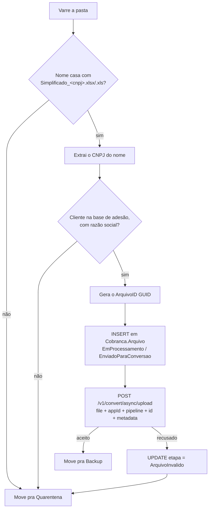

# Regras de negócio

Um worker só: `CnabRetorno.ExcelCnab.Worker`. Ele varre uma pasta,
identifica o cliente dono de cada planilha e entrega a planilha ao
conversor de layout, que faz o CNAB. Compartilha o `CnabRetorno.Core`
(domínio e contratos) e o `CnabRetorno.Common` (infraestrutura HTTP).

| | |
|---|---|
| Projeto | `CnabRetorno.ExcelCnab.Worker` |
| O que faz | Entrega ao conversor as planilhas depositadas numa pasta, identificando o cliente pelo nome do arquivo |
| Gatilho | Varredura periódica (cron) |
| Origem | Pasta local em dev; compartilhamento **SMB** montado no pod em hml/prd |
| Bases | `CASH_COBRANCA` (escreve `Cobranca.Arquivo`) e a base de **adesão** (lê razão social) |
| Converte? | Não faz a conversão — **entrega** ao conversor assíncrono, pipeline `excel-cnab`, appId `cash-cobranca` |
| Storage | Nenhum — a planilha vai no multipart da própria chamada, sem passar por bucket |
| Fila | Nenhuma — o robô termina no aceite; a conclusão é tratada por outro worker |

---

## O fluxo



O corpo da mensagem enviado ao conversor:

```jsonc
// campo "metadata" do multipart (nome configurável — ver Em aberto)
{ "cnpj": "12345678000199", "razaoSocial": "ACME DISTRIBUIDORA LTDA" }
```

## Regras por passo

| Passo | Regra | Onde |
|---|---|---|
| Varredura | Só o nível de cima da pasta. Backup e Quarentena vivem dentro dela, e varrer recursivamente reprocessaria o que já foi tratado. | `Origem/PastaOrigemExcel.cs` |
| Varredura | Arquivo modificado há menos de `SegundosEstabilidade` é pulado — ler uma planilha que ainda está sendo copiada pro SMB enviaria meio arquivo ao conversor. | idem |
| Varredura | Arquivos `~$*` são pulados: é a trava que o Excel deixa na pasta enquanto alguém tem a planilha aberta, não a planilha de ninguém. Sem isso, entopem a quarentena todo ciclo. | idem |
| Nome | Máscara configurável, padrão `Simplificado_{cnpj}`, com extensão `.xlsx` ou `.xls`. Casamento **exato**: sufixo, prefixo ou nome parecido não passa. | `Origem/NomeArquivoSimplificado.cs` |
| Nome | O CNPJ pode vir pontuado (`12.345.678.0001-99`) e é normalizado pra 14 dígitos. A barra do CNPJ canônico não entra: é caractere proibido em nome de arquivo. | idem |
| Nome | O CNPJ do nome é a **única** identificação do cliente — a planilha nunca é aberta. Por isso a leitura é estrita: nome fora do padrão vai pra quarentena, nunca vira palpite. Enviar a planilha de um cliente com o CNPJ de outro é pior que não enviar. | idem |
| Cliente | Razão social vem da base de adesão, pelo CNPJ. Cliente ausente (ou sem razão social) **barra** o envio: é parte do payload que o conversor recebe, e uma planilha sem dono identificado não deve virar CNAB. Vai pra quarentena com log de erro. | `Persistencia/EmpresaAdesaoRepository.cs` |
| Conteúdo | A planilha **não é aberta**. O conteúdo é repassado como bytes opacos; quem entende o formato é o pipeline `excel-cnab`. Por isso não há biblioteca de Excel no projeto. | `Pipeline/ProcessadorArquivoExcelService.cs` |
| GUID | O `ArquivoID` nasce antes do envio e vai como `id` da conversão — um id só na cadeia inteira, nunca um GUID novo por chamada. | idem |
| Ordem | A linha em `Cobranca.Arquivo` é criada **antes** da chamada. O conversor é assíncrono e a conclusão chega depois correlacionada pelo `ArquivoID`; sem a linha, a conclusão chega sem ter onde se ancorar (`cash-cobranca-referencia.md` §2.4). | `Persistencia/ArquivoRepository.cs` |
| Registro | Estado inicial `EmProcessamento` / `EnviadoParaConversao` — o par que a máquina de estados da API dona da tabela permite. | idem |
| Content-type | `.xlsx` vai como OOXML e `.xls` como `application/vnd.ms-excel`. São formatos diferentes, não só extensões — mandar tudo como octet-stream obrigaria o pipeline a adivinhar pelo nome. | `Http/LayoutConversaoApiClient.cs` |
| Aceite | Só `status: "pending"` conta como aceite. Um 200 com outro status (ou sem status) é falha, não sucesso silencioso. | idem |
| Falha no envio | A linha vira `ArquivoInvalido` e o arquivo vai pra quarentena. Deixá-lo na origem faria o próximo ciclo criar uma segunda linha, com `ArquivoID` novo, pro mesmo arquivo; deixar a linha como "enviado pra conversão" a deixaria pendurada esperando uma conclusão que nunca chega. | `Pipeline/ProcessadorArquivoExcelService.cs` |
| Falha no envio | Se o `UPDATE` de `ArquivoInvalido` também falhar, o erro é logado como aviso e **não** sobe: o erro que importa é o do envio, e deixar o segundo subir trocaria a causa raiz por um erro de consequência. | idem |
| Movimentação de arquivo | Backup e Quarentena **nunca sobrescrevem**: homônimo ganha sufixo de timestamp. O mesmo cliente manda `Simplificado_<cnpj>` toda semana com o mesmo nome; na quarentena, sobrescrever seria perder justamente a evidência do problema. | `Origem/PastaOrigemExcel.cs` |
| Concorrência | A varredura inteira roda sob `sp_getapplock`. Duas réplicas varrendo a mesma pasta enviariam a mesma planilha duas vezes, cada uma com `ArquivoID` próprio — dois CNABs pro mesmo cliente. | `Persistencia/LockExecucaoExclusiva.cs` |
| Falha isolada | Erro num arquivo não derruba a varredura: vira contador de falha e o resto segue. Só a varredura em si é fatal. | `Pipeline/EnviarPlanilhasPipeline.cs` |

## O que o robô não faz

- **Não lê a planilha.** Nenhuma célula é interpretada aqui.
- **Não gera CNAB.** Quem gera é o pipeline `excel-cnab` do conversor.
- **Não guarda o arquivo em bucket.** A planilha vai no multipart da
  chamada; não há presign nem `PutObject` no caminho.
- **Não espera a conversão terminar.** O endpoint é assíncrono: o robô
  termina no aceite, e a mensagem de conclusão é tratada por outro worker
  do ecossistema, que se ancora no `ArquivoID`.
- **Não deduplica por conteúdo.** Duas planilhas idênticas enviadas em
  ciclos diferentes viram dois envios. O que evita reprocessar a mesma é a
  ida pra Backup no fim do ciclo.

## Em aberto

Dados de integração que ninguém confirmou — todos marcados com
`TODO(a-confirmar)` no código, todos configuráveis:

| O quê | Onde | Se estiver errado |
|---|---|---|
| **Schema da base de adesão** (nome de schema, tabela e colunas) | `Persistencia/AdesaoDbContext.cs` | Nenhuma planilha é enviada — é caminho crítico de todo arquivo |
| **Nome do campo de metadados** no multipart (hoje `metadata`) | `Conversao:CampoMetadados` | O conversor recebe o arquivo sem os dados do cliente |
| **Valores numéricos** de `ArquivoStatus`/`ArquivoEtapa` | `Core/Dominio/Arquivo.cs` | Corrompe o rastreamento de arquivo do ecossistema CASH inteiro |
| **Base URL do conversor** | `LayoutConversaoApi:BaseUrl` | Nenhuma chamada sai |
| **Autenticação das APIs** (API key? OAuth? mTLS?) | `ApiClientOptions.ApiKey` | Chamada rejeitada |
| **Status de aceite** além de `pending` | `ConvertAsyncUploadResponse.Aceito` | Envio aceito é tratado como falha |

Ver [`riscos-conhecidos.md`](riscos-conhecidos.md) pros riscos de
**comportamento** — onde o código roda sem erro e ainda assim faz a coisa
errada.
