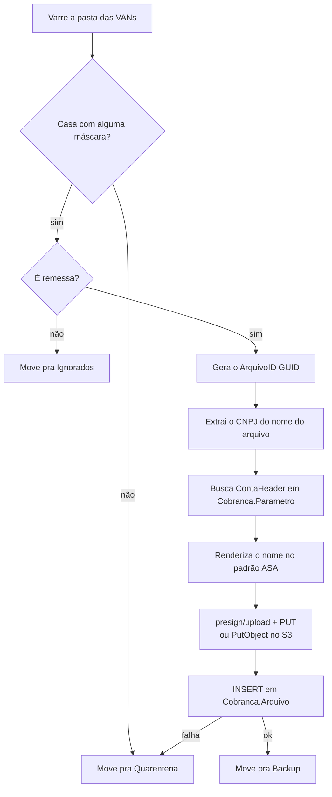
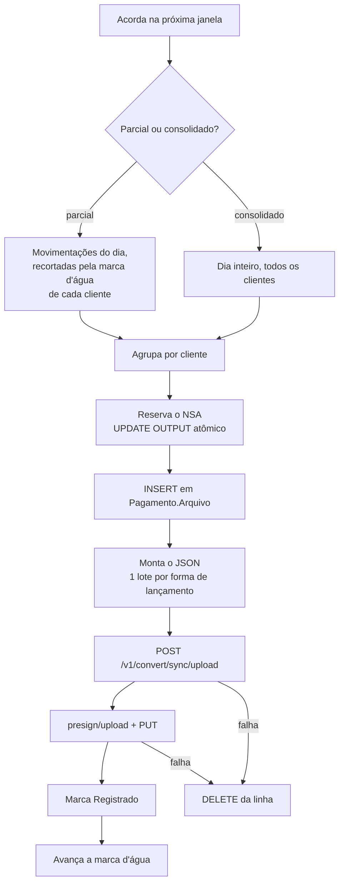

# Regras de negócio

Dois robôs independentes, sem comunicação entre si. Compartilham o
`CnabRetorno.Core` (domínio e contratos) e o `CnabRetorno.Common`
(infraestrutura HTTP, storage e mensageria), e nada mais.

| | Robô 1 | Robô 2 |
|---|---|---|
| Projeto | `CnabRetorno.RemessaVan.Worker` | `CnabRetorno.PagamentoRetorno.Worker` |
| O que faz | Ingere as remessas que as VANs depositam numa pasta | Gera os arquivos de retorno de pagamentos |
| Gatilho | Varredura periódica (cron) | Janelas de horário (07h–18h) |
| Base | `CASH_COBRANCA` | `ASA_CASH_PAGAMENTO` |
| Converte? | **Não** | Sim, JSON → CNAB síncrono |
| Fila | Nenhuma | Nenhuma |

---

## Robô 1 — ingestão de remessas de VAN

Segue os passos 0 a 9 do checklist de 03/08/2026, na ordem em que ele os
descreve.

### Regras por passo

| Passo | Regra | Onde |
|---|---|---|
| Varredura | Só o nível de cima da pasta. Backup/Quarentena/Ignorados vivem dentro dela, e varrer recursivamente reprocessaria o que já foi tratado. | `Origem/PastaOrigemRemessa.cs` |
| Varredura | Arquivo modificado há menos de `SegundosEstabilidade` é pulado — ler um arquivo que a VAN ainda está gravando registraria uma remessa pela metade como válida. | idem |
| Máscara | Primeira que casar vence, na ordem do `appsettings`. Sintaxe: `{cnpj}` captura 14 dígitos, `DDMMYY`/`DDMMYYYY`/`YYYYMMDD`/`DDMM` casam dígitos, `*` e `?` são curinga, o resto é literal. Sem diferenciar maiúsculas. | `Vans/MascaraVan.cs` |
| Máscara | Tokens de data são reconhecidos como **sequência inteira**, nunca letra a letra — senão o `M` de `.REM` viraria dígito e nenhum arquivo Nexxera casaria. | idem |
| Máscara | Arquivo sem CNPJ (nem no nome nem na configuração) **não casa**. Registrar sem saber de que cliente é seria pior que mandar pra quarentena. | idem |
| Tipo | Só `Remessa` é processada. As máscaras de `Retorno` existem pra que um retorno na mesma pasta seja reconhecido e movido pra `Ignorados`, em vez de cair na quarentena como "não reconhecido". | `Pipeline/ProcessadorArquivoRemessaService.cs` |
| GUID | O `ArquivoID` nasce **antes** do upload e vale pro storage e pro registro. Um id só na cadeia inteira, o que torna o reprocessamento idempotente do lado do storage (sobrescreve em vez de duplicar). | idem |
| ContaHeader | Sai de `Cobranca.Parametro` pelo `Documento`. Ausência **não** barra a ingestão: a coluna é anulável no destino, e travar aqui deixaria a remessa parada na pasta. Loga aviso. | `Persistencia/ParametroClienteRepository.cs` |
| Nome ASA | Template configurável. Tokens: `{documento}`, `{contaHeader}`, `{van}`, `{guid}`, `{original}`, `{ext}`, `{data:<formato>}`. Caracteres inválidos de nome de arquivo são removidos — os valores vêm de dado externo. | `Vans/NomeArquivoAsa.cs` |
| Storage | Duas implementações, escolhidas por `Storage:Modo`. Padrão `GestorArquivos` (presigned URL); `S3` grava direto via `PutObject`. | `Storage/S3Storage.cs`, `Common/Storage/GestorArquivoStorage.cs` |
| Registro | Falha **depois** do upload → quarentena, não backup. O objeto já está no bucket sem linha no banco; mandar pra backup faria o arquivo sumir da vista, e deixar na origem faria o próximo ciclo gravar um segundo objeto com GUID novo. O log carrega a referência do órfão. | `Pipeline/ProcessadorArquivoRemessaService.cs` |

### Não converte

O checklist não tem passo de conversão, e o robô não faz nenhuma. Ele
renomeia, guarda e registra; transformar o CNAB em JSON é
responsabilidade de outro worker do ecossistema, que parte do registro em
`Cobranca.Arquivo`.

---

## Robô 2 — retorno de pagamentos

### Janelas

| Regra | Detalhe |
|---|---|
| Grade | Parciais de `HoraInicio` até `HoraFim`, espaçadas por `IntervaloParcial`. A de `HoraFim` é o **consolidado**, nunca mais uma parcial — gerar os dois no mesmo instante mandaria dois arquivos pro cliente. |
| Padrão | 07h às 18h, de hora em hora: 11 parciais (07h–17h) + 1 consolidado (18h). |
| Fim fora da grade | Se `HoraFim` não cai certinho no espaçamento, ele acontece assim mesmo — é o fechamento do dia. |
| Fuso | `America/Sao_Paulo` por padrão. Sem isso, um pod em UTC geraria o "arquivo das 7h" às 4h da manhã. |
| Restart | Não recupera janela perdida. Não precisa: a marca d'água é por cliente, então o parcial seguinte leva o que ficou pra trás. |

### O que entra no arquivo

Só estados **finais** de `Pagamento.Status`: `3` Rejeitado, `4` Cancelado,
`5` Erro e `6` Finalizado. `1` Incluído e `2` Processando ainda estão em
voo e voltariam depois com outro status — reportá-los mandaria informação
contraditória pro cliente, que é o tipo de erro que não dá pra desfazer
num arquivo já entregue.

O corte é sobre `COALESCE(DataAtualizacao, DataCriacao)`: o instante do
desfecho. `DataCriacao` sozinha diria quando o pagamento foi registrado,
que pode ser dias antes de ele acontecer.

### Delta e marca d'água

O parcial é **delta**; o consolidado é o dia inteiro.

A marca d'água (`Pagamento.ControleJanelaRetorno`, tabela nova — DDL em
[`deploy/pagamento-controle-janela.sql`](../deploy/pagamento-controle-janela.sql))
guarda, por cliente e dia, o **maior instante de desfecho efetivamente
incluído** num arquivo — e não o horário da janela. A diferença importa:
uma movimentação com desfecho às 8h05 que só é gravada no banco às 8h20
ficaria de fora pra sempre se o corte fosse "8h30".

Por ser por cliente, o recorte não pode ser um intervalo único na
consulta: um cliente pode ter falhado na janela anterior enquanto os
outros passaram. Busca-se o dia todo e corta-se cliente a cliente.

Em banco, e não em memória: um restart no meio do expediente com o
controle em memória faria o parcial seguinte reenviar movimentações que o
cliente já recebeu.

### Estrutura do JSON

Um arquivo, **N lotes — um por forma de lançamento presente**. Isso é
imposição do layout: o header de lote carrega uma única Forma de
Lançamento (posições 12-13), então TEF, TED e boleto não podem dividir
lote. É a diferença estrutural em relação ao JSON de cobrança, que tinha
lote no singular.

| Meio | Forma (G029) | Segmento |
|---|---|---|
| TEF | `01` Crédito em Conta Corrente | A (+B) |
| TED | `41` TED Outra Titularidade | A (+B) |
| PIX sem chave | `45` PIX Transferência | A (+B) |
| PIX com chave/URL | `47` PIX QR-Code | J (+J-52 PIX) |
| Boleto/Tricon, banco ASA | `30` Liquidação de Título do Próprio Banco | J (+J-52) |
| Boleto/Tricon, outro banco | `31` Pagamento de Título de Outros Bancos | J (+J-52) |

Cada pagamento ocupa **dois** registros de detalhe (A+B ou J+J-52), e o
sequencial do registro (G038) é por lote, reiniciado a cada um — por isso
a numeração anda de dois em dois: 1, 3, 5…

### `Linhas` — a remessa original

Todas as tabelas `*Info` têm `Linhas varchar(8000)` com os segmentos CNAB
da remessa como o cliente os enviou. É a **fonte de verdade preferida** na
montagem: o cliente concilia o retorno contra o que ele mandou, não contra
o que ficou normalizado no nosso banco. Nome truncado de outro jeito,
conta sem zeros à esquerda ou agência com DV separado seriam divergências
suficientes pra quebrar a conciliação.

Quando `Linhas` vem vazio (pagamento originado por API, não por arquivo),
a montagem cai nas colunas.

> **Decisão consciente:** ter o CNAB cru abriria a porta pra gerar o
> retorno na mão, ecoando as linhas com a ocorrência preenchida. Não é o
> caminho escolhido — gerar CNAB à mão já foi tentado e abandonado neste
> projeto (`Cnab240GeradorSegmentos` foi removido por isso), e o conversor
> é o motor de layout compartilhado do time. `Linhas` alimenta os
> **valores** do JSON; quem escreve o CNAB é o conversor.

### Ocorrências

`CodigoOcorrencia varchar(10)` das tabelas de cabeçalho tem exatamente a
largura do campo G059 ("Códigos das Ocorrências p/ Retorno", 10 posições,
até 5 ocorrências de 2 dígitos, posições 231-240). Isso indica que o dado
já é gravado no formato de destino, então **quando vem preenchido, é ele
que vale**.

O mapeamento por status é só o fallback:

| Status | Ocorrência |
|---|---|
| `6` Finalizado | `00` Crédito ou Débito Efetivado |
| `4` Cancelado | `02` Crédito ou Débito Cancelado pelo Pagador/Credor |
| `3` Rejeitado / `5` Erro | brancos |

Rejeitado e Erro caem em brancos porque não existe ocorrência genérica de
"rejeitado" no G059 — os códigos são todos específicos do motivo (`AE`,
`AG`, `CD`…). Inventar um erraria o motivo.

### Valor e data reais

`P003` (Data Real da Efetivação) e `P004` (Valor Real) só existem no
retorno e dizem o que **de fato** aconteceu. Num pagamento que não se
efetivou (rejeitado, cancelado, erro) vão zerados: preenchê-los com o
valor agendado faria o cliente conciliar uma baixa que não houve.

### Ordem das escritas

1. Reserva o NSA (atômico). Se falhar, nada foi criado.
2. Cria a linha em `Pagamento.Arquivo` — o `ArquivoID` é o id usado no
   conversor e no storage.
3. Converte e guarda. Falha daqui pra trás remove a linha: melhor não ter
   registro do que registrar um arquivo que não existe.
4. Marca `Registrado` e **só então** avança a marca d'água. Se o processo
   morrer entre os dois, o próximo parcial reenvia — duplicar é
   recuperável, perder não.

A falha de um cliente não derruba a janela.

### NSA

`Pagamento.Parametro.SequencialAtual`, reservado com `UPDATE … OUTPUT` num
único statement: incremento e leitura do valor novo acontecem atomicamente
no servidor, então duas execuções concorrentes nunca recebem o mesmo
número — o que um `SELECT` seguido de `UPDATE` não garantiria. O cliente
usa esse número pra detectar arquivo faltando ou repetido.

Um NSA reservado por um arquivo que depois falha fica **consumido** (buraco
na série). É o lado certo do trade-off: repetir um número é pior que pular
um.

---

## Filas

Nenhum dos dois robôs consome fila hoje — o Robô 1 é ingestão pura e o
Robô 2 usa o conversor síncrono. O suporte a SQS continua no
`CnabRetorno.Common` como capacidade da biblioteca compartilhada, e **todo
nome de fila vem de configuração** (`Sqs:Filas:<Apelido>` no appsettings,
sobrescrito por `Sqs__Filas__<Apelido>` como variável de ambiente). Nunca
literal em código.

---

## Em aberto

Tudo marcado com `TODO(a-confirmar)` no código. Os que bloqueiam
homologação:

| Ponto | Onde | Impacto |
|---|---|---|
| Nome do pipeline de conversão de pagamentos | `Http/ConversaoOptions.cs` | Sem o valor certo, o conversor rejeita a chamada. |
| Shape do JSON de pagamentos | `Core/Aplicacao/Dtos/RetornoPagamentoJson.cs` | É **proposta** derivada do layout, não contrato observado. |
| Schema de `Pagamento.Arquivo` e `Pagamento.Parametro` | `Persistencia/PagamentoDbContext.cs` | Não capturados; mapeados como espelho dos de cobrança. |
| Valores numéricos de `ArquivoStatus`/`ArquivoEtapa` | `Core/Dominio/Arquivo.cs` | Nomes conhecidos, números supostos — em tabela compartilhada. |
| `CodigoOcorrencia` é FEBRABAN mesmo? | `Core/Dominio/StatusPagamento.cs` | Se for código interno de mesma largura, o cliente recebe código inválido. |
| Padrão ASA de nomenclatura | `Vans/NomenclaturaOptions.cs` | Default é o espelho da convenção de retorno do próprio ASA. |
| Coluna de conta em `Cobranca.Parametro` | `Persistencia/CobrancaDbContext.cs` | Nome real não capturado. |
| Código do banco, nome, Tipo de Serviço (G025) | `Json/RetornoOptions.cs` | Header do arquivo sai errado. |

Ver [`riscos-conhecidos.md`](riscos-conhecidos.md) pros riscos de
comportamento (diferente destes, que são dados faltando).
