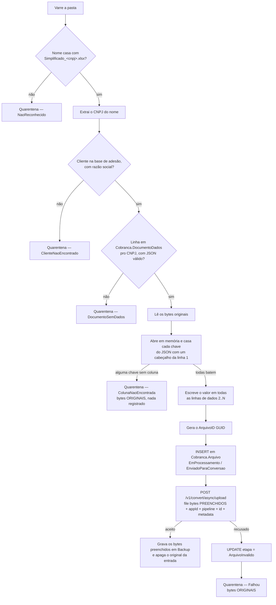

# Regras de negócio

Um worker só: `CnabRetorno.ExcelCnab.Worker`. Ele varre uma pasta,
identifica o documento dono de cada planilha, preenche a planilha com
dados de uma tabela SQL e entrega o resultado ao conversor de layout, que
faz o CNAB. Compartilha o `CnabRetorno.Core` (domínio e contratos) e o
`CnabRetorno.Common` (infraestrutura HTTP).

| | |
|---|---|
| Projeto | `CnabRetorno.ExcelCnab.Worker` |
| O que faz | Preenche e entrega ao conversor as planilhas depositadas numa pasta, identificando o documento pelo nome do arquivo |
| Gatilho | Varredura periódica (cron) |
| Origem | Pasta local em dev; compartilhamento **SMB** montado no pod em hml/prd |
| Bases | `CASH_COBRANCA` (escreve `Cobranca.Arquivo`, lê `Cobranca.DocumentoDados`) e a base de **adesão** (lê razão social) |
| Converte? | Não faz a conversão — **entrega** ao conversor assíncrono, pipeline `excel-cnab`, appId `cash-cobranca`, a planilha já preenchida |
| Preenchimento | Cada chave do JSON de `Cobranca.DocumentoDados.Dados` vira o valor de uma coluna (casada pelo cabeçalho da linha 1) em todas as linhas de dados da planilha |
| Storage | Nenhum — a planilha preenchida vai direto no multipart da chamada ao conversor e é gravada em `Backup` no fim |
| Fila | Não consome nem publica nenhuma |

---

## O fluxo



O corpo da mensagem enviado ao conversor:

```jsonc
// campo "metadata" do multipart (nome configurável — ver Em aberto)
{ "cnpj": "12345678000199", "razaoSocial": "ACME DISTRIBUIDORA LTDA" }
```

E o JSON de `Cobranca.DocumentoDados.Dados` que orienta o preenchimento:

```jsonc
{ "Nome Cliente": "ACME DISTRIBUIDORA LTDA", "Valor": "1500.00" }
```

Cada chave é comparada (por padrão ignorando caixa e espaço) com os
cabeçalhos da linha 1 da planilha; o valor correspondente é escrito, como
texto, em todas as linhas de dados existentes — o documento é o mesmo em
todo o arquivo, então o valor se repete.

"Terminei o processamento" aqui quer dizer: a planilha foi preenchida,
aceita pelo conversor e saiu da pasta de entrada. **Não** quer dizer que o
CNAB está pronto — quem avisa isso é a mensagem de conclusão do próprio
conversor, que chega depois. O `arquivoId` é o mesmo em toda a cadeia
(registro, conversão, conclusão), então quem consome consegue parear.

## Regras por passo

| Passo | Regra | Onde |
|---|---|---|
| Varredura | Só o nível de cima da pasta. Backup e Quarentena vivem dentro dela, e varrer recursivamente reprocessaria o que já foi tratado. | `Origem/PastaOrigemExcel.cs` |
| Varredura | Arquivo modificado há menos de `SegundosEstabilidade` é pulado — ler uma planilha que ainda está sendo copiada pro SMB corromperia o preenchimento. | idem |
| Varredura | Arquivos `~$*` são pulados: é a trava que o Excel deixa na pasta enquanto alguém tem a planilha aberta, não a planilha de ninguém. Sem isso, entopem a quarentena todo ciclo. | idem |
| Nome | Máscara configurável, padrão `Simplificado_{cnpj}`, extensão `.xlsx` (só — o ClosedXML não abre `.xls`). Casamento **exato**: sufixo, prefixo ou nome parecido não passa. | `Origem/NomeArquivoSimplificado.cs` |
| Nome | O CNPJ pode vir pontuado (`12.345.678.0001-99`) e é normalizado pra 14 dígitos. A barra do CNPJ canônico não entra: é caractere proibido em nome de arquivo. | idem |
| Nome | O CNPJ do nome é a **única** identificação do documento antes de abrir a planilha. Nome fora do padrão vai pra quarentena, nunca vira palpite — preencher a planilha de um cliente com o CNPJ de outro é pior que não preencher. | idem |
| Cliente | Razão social vem da base de adesão, pelo CNPJ. Cliente ausente (ou sem razão social) **barra** o envio: é parte do payload que o conversor recebe. Vai pra quarentena com log de erro. | `Persistencia/EmpresaAdesaoRepository.cs` |
| Dados de preenchimento | Vêm de `Cobranca.DocumentoDados`, pelo mesmo CNPJ — tabela só de leitura, populada por outro sistema. Sem linha, JSON malformado ou JSON vazio (`{}`) tratam-se como "documento sem dados": quarentena. | `Persistencia/DocumentoDadosRepository.cs` (busca) e `Core/Dominio/DocumentoDados.DesserializarDados()` (parsing do JSON) |
| Preenchimento | Cada chave do JSON precisa bater com **algum** cabeçalho da linha 1. Uma chave sem coluna correspondente rejeita a planilha inteira — nada é registrado nem enviado, e o arquivo original vai pra quarentena intacto. | `Planilha/PreenchedorPlanilhaExcel.cs` |
| Preenchimento | Comparação de cabeçalho ignora caixa e espaço por padrão (`Preenchimento:ComparacaoCabecalho`). Dois cabeçalhos que colidem na mesma chave normalizada também são tratados como erro (ambíguo). | idem |
| Preenchimento | O valor é sempre escrito como **texto**, nunca deixando a lib inferir tipo — evita perder zero à esquerda em campos como agência/conta/CNPJ. | idem |
| Preenchimento | Planilha sem nenhuma linha de dados (só cabeçalho) é rejeitada — não há onde escrever. | idem |
| GUID | O `ArquivoID` nasce **depois** do preenchimento e vale pro registro e pra conversão — um id só na cadeia inteira, nunca um GUID novo por chamada. | `Pipeline/ProcessadorArquivoExcelService.cs` |
| Ordem | A linha em `Cobranca.Arquivo` é criada **depois** que a planilha foi preenchida com sucesso, e **antes** da chamada ao conversor. Registrar cedo demais criaria uma linha órfã pra um arquivo que nunca é enviado; registrar tarde demais deixaria a conclusão assíncrona sem onde se ancorar (`cash-cobranca-referencia.md` §2.4). | `Persistencia/ArquivoRepository.cs` |
| Registro | Estado inicial `EmProcessamento` / `EnviadoParaConversao` — o par que a máquina de estados da API dona da tabela permite. | idem |
| Envio | O multipart carrega os bytes **já preenchidos**, não os originais. | `Http/LayoutConversaoApiClient.cs` |
| Content-type | `.xlsx` vai como OOXML (`application/vnd.openxmlformats-officedocument.spreadsheetml.sheet`). | idem |
| Aceite | Só `status: "pending"` conta como aceite. Um 200 com outro status (ou sem status) é falha, não sucesso silencioso. | idem |
| Falha no envio | A linha vira `ArquivoInvalido` e o arquivo **original** vai pra quarentena. Deixá-lo na origem faria o próximo ciclo criar uma segunda linha, com `ArquivoID` novo, pro mesmo arquivo; deixar a linha como "enviado pra conversão" a deixaria pendurada esperando uma conclusão que nunca chega. | `Pipeline/ProcessadorArquivoExcelService.cs` |
| Falha no envio | Se o `UPDATE` de `ArquivoInvalido` também falhar, o erro é logado como aviso e **não** sobe: o erro que importa é o do envio, e deixar o segundo subir trocaria a causa raiz por um erro de consequência. | idem |
| Backup | Guarda a planilha **preenchida** — o que de fato foi mandado ao conversor —, não a original. Só depois de gravar o backup o arquivo some da entrada. | `Origem/PastaOrigemExcel.cs` |
| Quarentena | Sempre recebe o arquivo **original** intacto: é a evidência do problema, nunca a versão parcialmente preenchida. | idem |
| Movimentação de arquivo | Backup e Quarentena **nunca sobrescrevem**: homônimo ganha sufixo de timestamp. O mesmo cliente manda `Simplificado_<cnpj>` toda semana com o mesmo nome; na quarentena, sobrescrever seria perder justamente a evidência do problema. | idem |
| Concorrência | A varredura inteira roda sob `sp_getapplock`. Duas réplicas varrendo a mesma pasta enviariam a mesma planilha duas vezes, cada uma com `ArquivoID` próprio — dois CNABs pro mesmo cliente. | `Persistencia/LockExecucaoExclusiva.cs` |
| Falha isolada | Erro num arquivo não derruba a varredura: vira contador de falha e o resto segue. Só a varredura em si é fatal. | `Pipeline/EnviarPlanilhasPipeline.cs` |

## O que o robô não faz

- **Não gera CNAB.** Quem gera é o pipeline `excel-cnab` do conversor —
  este worker só preenche colunas que já existem na planilha.
- **Não popula `Cobranca.DocumentoDados`.** É tabela só de leitura aqui;
  quem escreve nela é outro sistema.
- **Não cria colunas novas na planilha.** Uma chave do JSON sem cabeçalho
  correspondente é erro, não uma coluna nova.
- **Não espera a conversão terminar.** O endpoint é assíncrono: o robô
  termina no aceite, e a mensagem de conclusão é tratada por outro worker
  do ecossistema, que se ancora no `ArquivoID`.
- **Não consome nem publica em fila nenhuma.**
- **Não deduplica por conteúdo.** Duas planilhas idênticas enviadas em
  ciclos diferentes viram dois envios. O que evita reprocessar a mesma é a
  ida pra Backup no fim do ciclo.
- **Não guarda cópia em storage externo.** A planilha preenchida vai
  direto no multipart do conversor; o que sobra dela fica em `Backup`,
  local (ou no compartilhamento SMB).

## Em aberto

Dados de integração que ninguém confirmou — todos marcados com
`TODO(a-confirmar)` no código, todos configuráveis:

| O quê | Onde | Se estiver errado |
|---|---|---|
| **Schema da base de adesão** (nome de schema, tabela e colunas) | `Persistencia/AdesaoDbContext.cs` | Nenhuma planilha é processada — é caminho crítico de todo arquivo |
| **Schema de `Cobranca.DocumentoDados`** (formato de `NumeroDocumento`, uma linha por documento) | `Core/Dominio/DocumentoDados.cs`, `deploy/criar-tabela-documento-dados.sql` | A busca por CNPJ não bate com o que o time dono grava, e todo arquivo vai pra "documento sem dados" |
| **Nome do campo de metadados** no multipart (hoje `metadata`) | `Conversao:CampoMetadados` | O conversor recebe o arquivo sem os dados do cliente |
| **Valores numéricos** de `ArquivoStatus`/`ArquivoEtapa` | `Core/Dominio/Arquivo.cs` | Corrompe o rastreamento de arquivo do ecossistema CASH inteiro |
| **Base URL do conversor** | `LayoutConversaoApi:BaseUrl` | Nenhuma chamada sai |
| **Autenticação das APIs** (API key? OAuth? mTLS?) | `ApiClientOptions.ApiKey` | Chamada rejeitada |
| **Status de aceite** além de `pending` | `ConvertAsyncUploadResponse.Aceito` | Envio aceito é tratado como falha |
| **`.xls` ainda chega em produção?** | `Nomenclatura:Extensoes`, `Planilha/PreenchedorPlanilhaExcel.cs` | O ClosedXML não abre `.xls` — precisaria trocar por NPOI |

Ver [`riscos-conhecidos.md`](riscos-conhecidos.md) pros riscos de
**comportamento** — onde o código roda sem erro e ainda assim faz a coisa
errada.
